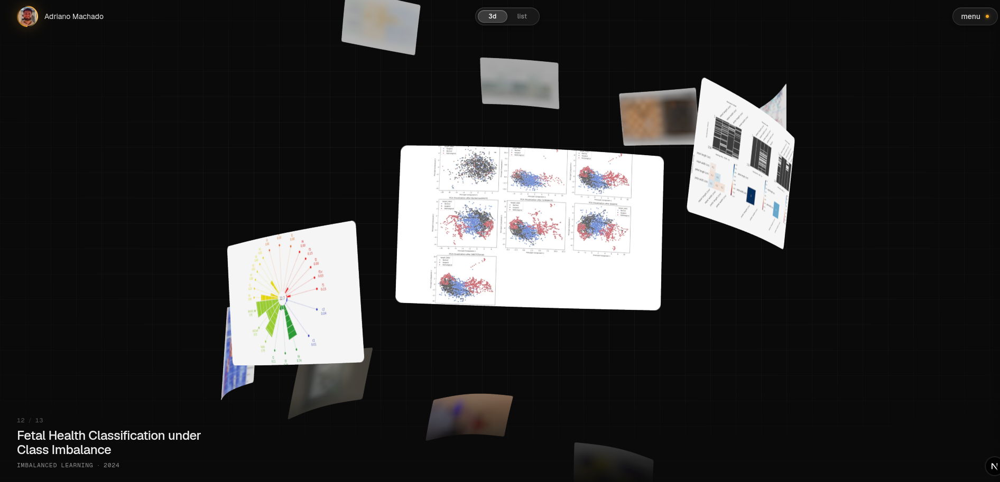

# Portfolio



A personal site to showcase my projects. A 3D helix of project cards you scroll through, a list view, and case-study pages. Built with Next.js, React Three Fiber and GSAP.

## Run

```bash
pnpm install
pnpm dev        # http://localhost:3000
pnpm build      # static production build
pnpm lint
```

## Structure

| Path | What |
| --- | --- |
| `content/projects/*.mdx` | One case study per file. Frontmatter drives the card (title, year, tags, accent, `repo`, `reports`); the body is the page at `/work/<slug>`. |
| `public/projects/<slug>/` | `cover.webp` (1280×800) and `cover-sm.webp` (640×400) for the card, plus any figures the case study uses and the report PDFs listed under `reports` in the frontmatter. |
| `scripts/covers.mjs`, `scripts/figures.mjs` | Sharp scripts that produced the WebP assets from the original repo figures. |
| `scripts/avatar.mjs` | Builds `public/avatar.webp` and the favicons in `app/` from `content/profile.jpg`. |
| `lib/helix.ts` | Pure layout math and the tunable helix parameters (`DESKTOP_HELIX`, `MOBILE_HELIX`). |
| `lib/virtualScroll.ts` | Wheel / drag / touch / keyboard accumulator that drives the helix. |
| `components/canvas/CardMaterial.ts` | GLSL for the cards: cover-fit, "denoise" reveal, depth dim + mip-bias blur, hover zoom, rounded corners. |
| `components/canvas/Helix.tsx` | Scene: poses, hover/click, list-view preview, click-to-case-study transition. |
| `components/ui/*` | Header, spiral/list toggle, menu, loader, active-card caption, list view. |
| `lib/site.ts` | Name, links, e-mail, canonical URL. |

## Adding a project

1. Create `content/projects/<slug>.mdx` with frontmatter (copy an existing one). `order` controls the position in the helix.
2. Add `public/projects/<slug>/cover.webp` and `cover-sm.webp` (16:10). `node scripts/covers.mjs <dir>` shows how they were made.
3. Write the body using `<Lead>`, `<Figure>` and `<Table>` (see `components/mdx`).

*Inspired by [Pacôme Pertant's](https://pacomepertant.com/) portfolio.*
